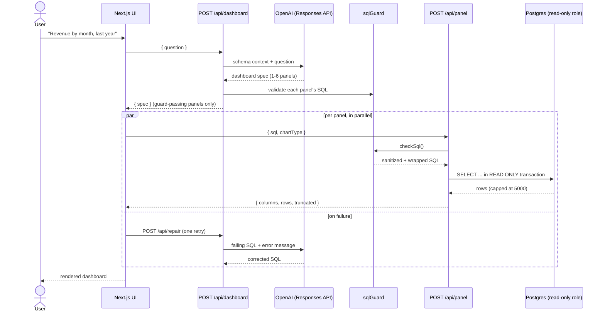

<div align="center">

# prompt-to-dashboard

**Ask for a dashboard in plain English. Get one — charts, numbers, and all — without ever seeing SQL.**

[](LICENSE)
[](https://nextjs.org)
[](https://www.typescriptlang.org)
[](https://www.postgresql.org)
[](CONTRIBUTING.md)

[Overview](#overview) · [Architecture](#architecture) · [Getting started](#getting-started) · [API](#api-reference) · [Safety](#safety-model) · [Roadmap](#roadmap)

</div>

---

## Overview

`prompt-to-dashboard` is an **embeddable AI dashboard engine**: a layer that adds plain-English
dashboard creation on top of a connection to *your own* database. A non-technical user types a
request — *"show me revenue by month over the last year"*, *"give me an overview of this
database"* — and the engine designs, generates, executes, and renders a real, interactive
dashboard against a live Postgres database. No SQL, code, or error message is ever surfaced to
the end user.

It is deliberately **not** a destination BI product. The engine knows nothing about any
particular schema, sector, or vendor: everything it understands about your data comes from a
schema context file generated by introspecting whatever database you point it at. The included
Next.js app is a thin demo/dev harness around the engine (`lib/` + the introspection script),
which is the part designed to be embedded.

**Highlights**

- 🧠 **LLM-designed dashboards** — one structured-output call turns a question into a 1–6 panel spec (chart type, fields, SQL) using the OpenAI Responses API.
- 💬 **Conversational follow-ups** — "make this a pie chart", "add revenue by country", "only 2024": each request carries the conversation history, the model decides whether to update the dashboard on screen or start a new one, and unchanged panels reuse cached results without re-querying.
- ⬇️ **Downloadable output** — the whole dashboard as a PNG image or a JSON export (spec + queries + data), and per-panel CSVs.
- 🛡️ **Defense-in-depth SQL safety** — a dedicated read-only Postgres role, read-only transactions, an application-level SQL guard, and a hard row cap make destructive queries structurally impossible, not just discouraged.
- 🔧 **Self-healing queries** — if a generated query fails, the agent gets one automatic shot at repairing it before the user ever sees an error.
- 📊 **Six chart types** — line, bar, area, pie, stat, and table, rendered with Recharts and a graceful fallback to a table when a spec doesn't match the returned columns.
- 🗄️ **Bring-your-own-schema** — a generic schema-introspection script builds the LLM's context from any PostgreSQL-compatible database; nothing about your schema is assumed or hardcoded.

## Architecture



**Request flow, in one paragraph:** a question is POSTed to `/api/dashboard`; one LLM call — with
your database's generated schema context and the current date injected into the system prompt —
returns a `DashboardSpec` (title, summary, 1–6 panels of `{title, chartType, sql, field
mappings}`). The frontend renders the dashboard shell immediately and fetches `/api/panel` for
every panel in parallel; each request is validated by `sqlGuard`, wrapped in a hard `LIMIT 5001`,
and executed inside a read-only transaction on a dedicated `dashboard_reader` role. Panels
resolve independently — skeleton → chart. A panel whose SQL fails gets exactly one automatic
repair attempt via `/api/repair` before falling back to a friendly error card.

## Tech stack

| Layer | Choice |
|---|---|
| Framework | [Next.js 15](https://nextjs.org) (App Router, Turbopack) |
| Language | TypeScript, strict mode |
| LLM | OpenAI [Responses API](https://platform.openai.com/docs/api-reference/responses) with strict structured outputs (`gpt-5.6-terra`, `gpt-5.6-luna` fallback) |
| Database | Any PostgreSQL-compatible database, via [node-postgres](https://node-postgres.com) |
| Validation | [Zod](https://zod.dev) v3 (schema source-of-truth for both TypeScript types and the LLM's JSON schema) |
| Charts | [Recharts](https://recharts.org) 3 |
| Styling | Tailwind CSS v4 |

## Getting started

### Prerequisites

- Node.js ≥ 20
- A PostgreSQL-compatible database
- An [OpenAI API key](https://platform.openai.com/api-keys)

### Installation

```bash
git clone https://github.com/LeandHadergjonaj/text-to-sql.git
cd text-to-sql
npm install
```

### Configuration

```bash
cp .env.example .env.local
```

| Variable | Required | Description |
|---|---|---|
| `OPENAI_API_KEY` | yes | Your OpenAI API key. |
| `DATABASE_URL_READONLY` | no | Optional **built-in connection**: a read-only connection string exposed to every user of the deployment (see below). With in-app onboarding this is no longer required. |
| `APP_SECRET` | no | Key material for connection-credential encryption and identity-cookie signing (minimum 16 characters; generate with `openssl rand -base64 32`). When unset, a random key is generated once and persisted at `.data/secret.key`. Set it explicitly in production so the data in `.data/` survives moves between hosts. |
| `OPENAI_MODEL` | no | Overrides the default model (`gpt-5.6-terra`). |
| `NEXT_PUBLIC_CURRENCY` | no | ISO 4217 code used to format `currency` values (default `USD`). |
| `NEXT_PUBLIC_LOCALE` | no | BCP 47 locale used for number/date formatting (default `en-US`). |

### Connect a database (in-app, recommended)

Open **`/app/connect`** and paste an admin connection string once. The app then:

1. introspects the schema (tables, columns, foreign keys, row counts, sampled values, date coverage),
2. creates (or rotates) a dedicated `SELECT`-only `dashboard_reader` role with a generated password,
3. verifies the new role can read but **cannot** write (a write probe must fail with PostgreSQL's
   "read-only transaction" error — any other outcome rejects the connection),
4. shows a plain-English summary of what it found,
5. stores only the **read-only** connection string, AES-256-GCM-encrypted, in the app's local
   metadata store (`.data/app.db`). The admin credentials are used for that one request and never persisted.

Connections, saved dashboards, and learned examples are all scoped to the browser identity
(a signed cookie), so multiple users of one deployment don't see each other's data.

### Or: env-configured built-in connection

The pre-onboarding setup still works and is useful for a single-database deployment where
everyone should share one connection. Create the role manually:

```bash
psql "$ADMIN_DATABASE_URL" -v ON_ERROR_STOP=1 -v reader_password="<choose-a-password>" -f db/readonly_role.sql
```

set `DATABASE_URL_READONLY` to the resulting role's connection string, then generate the LLM's
schema context file:

```bash
DATABASE_URL="<admin or read-only connection string>" npm run introspect
```

This writes `db/schema-context.md` — **local to your deployment and gitignored** (it contains
your schema and sampled data values — treat it as sensitive). Re-run it whenever your schema
changes. In-app-onboarded connections refresh their context by re-running `/app/connect`
against the same database.

### Run

```bash
npm run dev       # http://localhost:3000
```

```bash
npm run build && npm run start   # production build
```

## Project structure

```
.
├── app/
│   ├── api/
│   │   ├── dashboard/route.ts   # question -> dashboard spec (1 LLM call, few-shot retrieval)
│   │   ├── panel/route.ts       # sql -> validated, executed query result
│   │   ├── repair/route.ts      # failing sql -> corrected sql (1 LLM call)
│   │   ├── connections/         # onboarding: create/list/delete database connections
│   │   └── dashboards/          # saved dashboards: save/list/open/rename/re-save/delete
│   ├── app/                     # the product: dashboard UI, /connect wizard, /dashboards list
│   ├── layout.tsx
│   └── page.tsx                 # marketing homepage
├── components/
│   ├── charts/                  # one component per chart type + dispatcher
│   └── *.tsx                    # prompt bar, dashboard grid, panel card, download menu, error/empty states
├── hooks/
│   └── useDashboard.ts          # fetch orchestration, conversation history, per-panel state, save/load
├── lib/                         # the engine
│   ├── env.ts                   # fail-fast environment validation
│   ├── types.ts                 # Zod schemas: single source of truth for types + LLM JSON schema
│   ├── appStore.ts              # SQLite metadata store (.data/app.db) + versioned migrations
│   ├── identity.ts              # anonymous signed-cookie per-browser identity
│   ├── secrets.ts               # AES-256-GCM credential encryption + cookie signing
│   ├── connections.ts           # onboarding, encrypted DSNs, per-connection pools + execution contexts
│   ├── introspect.ts            # schema introspection -> markdown context + binding catalog + stats
│   ├── dashboards.ts            # saved-dashboard store access
│   ├── examples.ts              # accepted (question -> SQL) store + embedding retrieval
│   ├── schemaContext.ts         # lazy loader for the env connection's generated schema context
│   ├── sqlGuard.ts              # AST-based SQL guard + legacy fallback (see Safety model)
│   ├── db.ts                    # read-only pool factory + panel query execution + EXPLAIN cost probe
│   ├── telemetry.ts             # local panel-run telemetry (append-only, capped, best-effort)
│   ├── advisor.ts               # performance advisor: telemetry aggregates -> admin suggestions
│   ├── download.ts              # client-side CSV/JSON/PNG export helpers
│   └── openai.ts                # OpenAI client, prompts, dashboard/repair/summary generation, embeddings
├── db/
│   ├── readonly_role.sql        # generic read-only role setup (manual/env path)
│   └── schema-context.md        # generated locally per deployment (gitignored)
├── skills/                      # gathered, sourced knowledge on doing this work well
│   ├── dashboard-design/        # chart choice, composition, design rules
│   ├── analytical-sql/          # Postgres correctness, patterns, style, performance
│   ├── text-to-sql/             # LLM SQL generation techniques and guardrails
│   └── conversational-analytics/# multi-turn follow-up design
└── scripts/
    ├── introspect-schema.ts     # generates db/schema-context.md (env connection path)
    ├── fixture-bigdb.ts         # provisions a 10M-row synthetic database for big-data testing
    ├── test-sqlguard.ts         # sqlGuard unit test cases
    ├── test-prompt.ts           # prompt regression guards (quoting, multi-source, timeout repair)
    └── test-appstore.ts         # migration-ladder invariants
```

## API reference

All three routes return `{ error: { code, friendlyMessage, debug } }` on failure — `friendlyMessage`
is safe to show a user; `debug` carries the raw error and is only surfaced in the UI behind `?debug=1`.

<details>
<summary><code>POST /api/dashboard</code></summary>

```jsonc
// Request — `history` is optional; omit it for single-shot use.
// Each turn is a compact record of a prior request and the dashboard it produced.
{
  "question": "make this a pie chart",
  "history": [
    {
      "question": "orders by region",
      "dashboardTitle": "Orders by Region",
      "panels": [{ "title": "...", "chartType": "bar", "sql": "SELECT ...", "connectionId": "env" }]
    }
  ],
  // optional: every source this dashboard may draw from, primary first
  // ('env' = the built-in connection; max 3). Omit to use connectionId alone.
  "connectionIds": ["env", "conn-b"]
}

// Response 200 — `mode` is "update" when the spec refines the previous turn's
// dashboard (unchanged panels keep their SQL verbatim so the client can reuse
// cached results), "new" for a fresh dashboard. Always "new" without history.
{
  "spec": {
    "mode": "update",
    "title": "Orders by Region",
    "summary": "Share of orders per region.",
    "panels": [
      { "id": "panel-0", "connectionId": "env", "title": "...", "chartType": "pie", "sql": "SELECT ...", "labelField": "...", "valueField": "...", "unit": "count", "...": "..." }
    ]
  }
}
```

</details>

<details>
<summary><code>POST /api/panel</code></summary>

```jsonc
// Request
{ "sql": "SELECT ...", "chartType": "bar" }

// Response 200
{ "columns": [{ "name": "...", "type": "number" }], "rows": [[/* ... */]], "truncated": false }
```

</details>

<details>
<summary><code>POST /api/repair</code></summary>

```jsonc
// Request — errorCode is optional; "query_timeout" switches the repair
// prompt to the do-less-work instruction set.
{ "question": "...", "panel": { /* PanelSpec */ }, "sql": "...", "errorMessage": "...", "errorCode": "query_timeout" }

// Response 200
{ "sql": "SELECT ... /* corrected */" }
```

</details>

<details>
<summary><code>PATCH /api/connections/:id</code> · <code>GET /api/connections/:id/advice</code></summary>

```jsonc
// PATCH — per-connection execution settings (id 'env' targets the built-in connection)
{ "settings": { "statementTimeoutMs": 60000, "maxResultRows": 10000 } }
// -> { "settings": { "statementTimeoutMs": 60000, "maxResultRows": 10000 } }

// GET /api/connections/:id/advice — performance suggestions from local telemetry.
// DDL is for a human admin; the app never executes it.
// -> { "advice": { "totalRuns": 120, "timeouts": 6, "avgDurationMs": 840,
//                  "tables": [ /* per-table stats */ ],
//                  "suggestions": [{ "title": "...", "ddl": "CREATE INDEX CONCURRENTLY ...", "rationale": "..." }],
//                  "source": "llm" } }
```

</details>

## Safety model

Generated SQL can never modify or delete data. This is enforced by four independent layers, any one
of which would stop a write on its own:

1. **Dedicated Postgres role** (`dashboard_reader`, created by `db/readonly_role.sql`) — `SELECT`-only grants, `default_transaction_read_only = on`, a role-level `statement_timeout` ceiling of 120s (the app enforces the effective per-connection timeout, default 20s, as a connection parameter — see "Per-connection settings" below), and no `CREATE` privilege on the schema. Connections onboarded before this change carry a 20s role default, which caps per-connection values above it until the database is re-onboarded.
2. **Read-only transactions** — every panel query runs inside `BEGIN TRANSACTION READ ONLY`.
3. **Application-level AST guard** (`lib/sqlGuard.ts`) — parses every candidate query with the real PostgreSQL parser ([libpg-query](https://github.com/launchql/libpg-query-node), WASM) and validates it structurally: exactly one statement, and it must be a `SelectStmt` (every write/DDL/utility statement is a different node type, which covers the whole old keyword denylist with zero false positives on literals); no `SELECT … INTO`, no `FOR UPDATE/SHARE`, no data-modifying CTEs; a denylist of dangerous *functions* (`pg_sleep`, `pg_read_file`, `dblink*`, `pg_advisory_*`, `set_config`, the `query_to_xml` family, …); and **table-level identifier binding** — every referenced table must exist in the connection's introspected catalog (or be a CTE), which blocks `pg_catalog`/`information_schema` reads and catches hallucinated tables before execution. If the parser module ever fails to load, the previous keyword-denylist guard (kept in the same file) takes over automatically, so coverage never drops below the old level. Covered by unit tests: `npm run test:sqlguard`.
4. **Hard result cap** — every query is wrapped as `SELECT * FROM (...) AS _panel LIMIT <cap+1>` (cap defaults to 5000, configurable per connection between 100 and 20,000), so even a legitimate but unbounded `SELECT` can't return unlimited rows.

The app also runs `EXPLAIN (FORMAT JSON)` before executing each panel to record the planner's cost estimate into local telemetry (see below). That `EXPLAIN` is issued only by the app's own code — an `EXPLAIN` arriving from the model is still rejected by the AST guard as a non-`SELECT` statement.

## Multiple data sources

A dashboard can draw panels from up to **three** connections side by side: pick a primary in the
header, add comparison sources with **+ compare**, and ask e.g. *"revenue from Production next to
signups from Analytics"*. Each panel queries exactly one database (its badge shows which); its SQL
is validated against that connection's own catalog, so a query that references another source's
tables is rejected before execution. Adding a comparison source keeps the conversation; switching
the primary starts a new one.

### Cross-source joins (`postgres_fdw` hub)

True joins across databases don't need any engine feature — PostgreSQL federates natively, and the
engine treats whatever is in the hub's `public` schema as the schema. As an admin, create a hub
database once:

```sql
CREATE EXTENSION postgres_fdw;
CREATE SERVER src_a FOREIGN DATA WRAPPER postgres_fdw
  OPTIONS (host 'a.example.com', dbname 'a', fetch_size '1000');
CREATE USER MAPPING FOR dashboard_reader SERVER src_a
  OPTIONS (user 'dashboard_reader', password '<remote reader password>');
IMPORT FOREIGN SCHEMA public FROM SERVER src_a INTO a;
-- expose with source-prefixed names the LLM can distinguish:
CREATE VIEW public.a__orders AS SELECT * FROM a.orders;
```

…repeat per source, then onboard the hub through `/app/connect` like any database. Introspection
documents views and foreign tables (columns included) and labels foreign relations as federated so
the model plans pushdown-friendly, aggregate-before-join SQL.

Notes:

- The user mapping should reference the **remote** database's `dashboard_reader`. Re-onboarding
  that remote source rotates its password and breaks the mapping — fix with
  `ALTER USER MAPPING FOR dashboard_reader SERVER src_a OPTIONS (SET password '<new>')`.
- The hub's statement timeout governs the whole federated query; keep remote role timeouts ≥ the
  hub's.
- For recurring, heavy cross-source analytics, ETL into a warehouse (even one more Postgres fed by
  Airbyte/Fivetran or a `pg_dump` cron) and onboard *that* — it beats live federation on cost,
  speed, and reliability, and this product consumes the result natively.

## Large databases

Data volume itself isn't the limit — the app never holds the dataset (all compute is pushed down;
only capped, aggregated results come back). What matters is query latency, and several mechanisms
keep it honest:

- **Bounded introspection** — onboarding samples values and date ranges under a 5s-per-query cap,
  switches to `TABLESAMPLE` on tables past ~2M rows, and skips enumeration past ~50M, noting each
  degradation in the schema context instead of hanging. Row counts appear humanized (`~40M`) and
  the generation prompt steers the model toward aggregates and date filters on such tables.
- **Timeout-aware repair** — a query cancelled by `statement_timeout` isn't "fixed" as if it were
  a syntax error; the repair prompt switches to *do less work* (pre-aggregate, narrow the date
  range, use an existing view). The panel's error card offers a one-click **Retry with last 90
  days**, which honestly re-plans the panel through the model rather than string-editing SQL.
- **Per-connection settings** — `PATCH /api/connections/:id` with
  `{ "settings": { "statementTimeoutMs": 5000–120000, "maxResultRows": 100–20000 } }` tunes the
  timeout and row cap per database (`env` targets the built-in connection).
- **Local telemetry** — every panel run (SQL text, duration, outcome, planner cost estimate) is
  recorded in `.data/app.db`, capped at 2,000 rows per connection. It stays on your deployment,
  never leaves it, and contains no result data.
- **Performance advisor** — the saved-dashboards page can turn that telemetry + your schema into
  2–4 copy-pasteable suggestions (indexes, materialized views, `ANALYZE`) with plain-English
  rationale. The app **never executes them** — you run them yourself as an admin; the read-only
  stance is the product.
- `npm run fixture:bigdb -- "<admin url>"` provisions a 10M-row synthetic database for testing
  all of the above locally.

## Roadmap

- [x] Saved dashboards (per-user; shareable links still to come)
- [x] In-app database onboarding (read-only role + introspection + verification)
- [x] Few-shot learning from accepted queries (per-connection example store + embedding retrieval)
- [x] AST-based SQL validation with identifier binding
- [x] Multi-source dashboards (per-panel connections, up to 3 sources side by side)
- [x] Large-database hardening (bounded introspection, timeout-aware repair, per-connection settings, local telemetry, performance advisor)
- [ ] Real authentication (the current per-browser cookie identity is the seam to swap it into)
- [ ] Streaming panel generation (render as the spec streams, not after)
- [ ] Query-result caching
- [ ] Drill-down interactions on charts
- [ ] Custom CA bundle support for database TLS
- [ ] Connectors beyond the Postgres wire protocol

## Contributing

Contributions are welcome — see [CONTRIBUTING.md](CONTRIBUTING.md) for local setup, coding
conventions, and how to submit a PR. Please also read the [Code of Conduct](CODE_OF_CONDUCT.md).

Found a security issue? Please see [SECURITY.md](SECURITY.md) rather than opening a public issue.

## License

MIT © [Leand Hadergjonaj](https://github.com/LeandHadergjonaj) — see [LICENSE](LICENSE).
