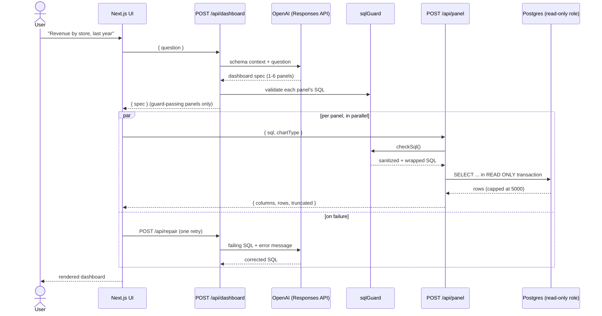

<div align="center">

# text-to-sql

**Ask for a dashboard in plain English. Get one — charts, numbers, and all — without ever seeing SQL.**

[](LICENSE)
[](https://nextjs.org)
[](https://www.typescriptlang.org)
[](https://supabase.com)
[](CONTRIBUTING.md)

[Overview](#overview) · [Architecture](#architecture) · [Getting started](#getting-started) · [API](#api-reference) · [Safety](#safety-model) · [Roadmap](#roadmap)

</div>

---

## Overview

`text-to-sql` is an end-to-end **text-to-dashboard** agent. A non-technical user types a request —
*"show me revenue by store over the last year"*, *"build me a dashboard on customer rentals"* — and
the system designs, generates, executes, and renders a real, interactive dashboard against a live
Postgres database. No SQL, code, or error message is ever surfaced to the end user.

It is not a chatbot that talks about data. It is an agent that goes and builds the dashboard.

**Highlights**

- 🧠 **LLM-designed dashboards** — one structured-output call turns a question into a 1–6 panel spec (chart type, fields, SQL) using the OpenAI Responses API.
- 🛡️ **Defense-in-depth SQL safety** — a dedicated read-only Postgres role, read-only transactions, an application-level SQL guard, and a hard row cap make destructive queries structurally impossible, not just discouraged.
- 🔧 **Self-healing queries** — if a generated query fails, the agent gets one automatic shot at repairing it before the user ever sees an error.
- 📊 **Six chart types** — line, bar, area, pie, stat, and table, rendered with Recharts and a graceful fallback to a table when a spec doesn't match the returned columns.
- 🗄️ **Bring-your-own-schema** — a generic schema-introspection script builds the LLM's context from any Postgres database; a full Pagila (DVD rental) load-and-scale pipeline is included as a reference dataset.

## Architecture



**Request flow, in one paragraph:** a question is POSTed to `/api/dashboard`; one LLM call — with
the live database schema and the current date injected into the system prompt — returns a
`DashboardSpec` (title, summary, 1–6 panels of `{title, chartType, sql, field mappings}`). The
frontend renders the dashboard shell immediately and fetches `/api/panel` for every panel in
parallel; each request is validated by `sqlGuard`, wrapped in a hard `LIMIT 5001`, and executed
inside a read-only transaction on a dedicated `dashboard_reader` role. Panels resolve independently
— skeleton → chart. A panel whose SQL fails gets exactly one automatic repair attempt via
`/api/repair` before falling back to a friendly error card.

## Tech stack

| Layer | Choice |
|---|---|
| Framework | [Next.js 15](https://nextjs.org) (App Router, Turbopack) |
| Language | TypeScript, strict mode |
| LLM | OpenAI [Responses API](https://platform.openai.com/docs/api-reference/responses) with strict structured outputs (`gpt-5.6-terra`, `gpt-5.6-luna` fallback) |
| Database | PostgreSQL via [Supabase](https://supabase.com), [node-postgres](https://node-postgres.com) |
| Validation | [Zod](https://zod.dev) v3 (schema source-of-truth for both TypeScript types and the LLM's JSON schema) |
| Charts | [Recharts](https://recharts.org) 3 |
| Styling | Tailwind CSS v4 |

## Getting started

### Prerequisites

- Node.js ≥ 20
- A PostgreSQL database (this project targets [Supabase](https://supabase.com), but any Postgres works)
- An [OpenAI API key](https://platform.openai.com/api-keys)

### Installation

```bash
git clone https://github.com/LeandHadergjonaj/text-to-sql.git
cd text-to-sql
npm install
```

### Configuration

```bash
cp .env.example .env.local
```

| Variable | Required | Description |
|---|---|---|
| `DATABASE_URL_READONLY` | yes | Connection string for a **read-only** Postgres role (see [Safety model](#safety-model) — never point this at an admin role). |
| `OPENAI_API_KEY` | yes | Your OpenAI API key. |
| `OPENAI_MODEL` | no | Overrides the default model (`gpt-5.6-terra`). |

### Generate the schema context

The LLM's understanding of your database comes from a generated markdown file, not a live schema
call on every request:

```bash
DATABASE_URL="<admin connection string>" node scripts/introspect-schema.mjs
```

This writes `db/schema-context.md` — tables, columns, foreign keys, row counts, and sampled/distinct
values for low-cardinality columns. Commit it; the API routes read it at process startup. Re-run it
whenever the schema changes.

### Run

```bash
npm run dev       # http://localhost:3000
```

```bash
npm run build && npm run start   # production build
```

## Project structure

```
.
├── app/
│   ├── api/
│   │   ├── dashboard/route.ts   # question -> dashboard spec (1 LLM call)
│   │   ├── panel/route.ts       # sql -> validated, executed query result
│   │   └── repair/route.ts      # failing sql -> corrected sql (1 LLM call)
│   ├── layout.tsx
│   └── page.tsx                 # dashboard UI shell / view state machine
├── components/
│   ├── charts/                  # one component per chart type + dispatcher
│   └── *.tsx                    # prompt bar, dashboard grid, panel card, error/empty states
├── hooks/
│   └── useDashboard.ts          # fetch orchestration, per-panel state, repair retries
├── lib/
│   ├── env.ts                   # fail-fast environment validation
│   ├── types.ts                 # Zod schemas: single source of truth for types + LLM JSON schema
│   ├── sqlGuard.ts               # SQL safety guard (see Safety model)
│   ├── db.ts                    # read-only pool + panel query execution
│   └── openai.ts                # OpenAI client, prompts, dashboard/repair generation
├── db/
│   ├── 00-05_*.sql               # Pagila load, scaling, and read-only role scripts
│   └── schema-context.md         # generated schema snapshot fed to the LLM
├── scripts/
│   ├── introspect-schema.mjs     # generates db/schema-context.md from any Postgres DB
│   ├── test-sqlguard.ts          # sqlGuard unit test cases
│   └── 01-04_*.sh                # Pagila fetch / load / scale / verify pipeline
└── PLAN.md                       # the original build spec this project was implemented from
```

## API reference

All three routes return `{ error: { code, friendlyMessage, debug } }` on failure — `friendlyMessage`
is safe to show a user; `debug` carries the raw error and is only surfaced in the UI behind `?debug=1`.

<details>
<summary><code>POST /api/dashboard</code></summary>

```jsonc
// Request
{ "question": "revenue by store over the last year" }

// Response 200
{
  "spec": {
    "title": "Revenue by Store",
    "summary": "Rental revenue for each store over the trailing 12 months.",
    "panels": [
      { "id": "panel-0", "title": "...", "chartType": "bar", "sql": "SELECT ...", "xField": "...", "yFields": ["..."], "unit": "currency", "...": "..." }
    ]
  }
}
```

</details>

<details>
<summary><code>POST /api/panel</code></summary>

```jsonc
// Request
{ "sql": "SELECT ...", "chartType": "bar" }

// Response 200
{ "columns": [{ "name": "...", "type": "number" }], "rows": [[/* ... */]], "truncated": false }
```

</details>

<details>
<summary><code>POST /api/repair</code></summary>

```jsonc
// Request
{ "question": "...", "panel": { /* PanelSpec */ }, "sql": "...", "errorMessage": "..." }

// Response 200
{ "sql": "SELECT ... /* corrected */" }
```

</details>

## Safety model

Generated SQL can never modify or delete data. This is enforced by four independent layers, any one
of which would stop a write on its own:

1. **Dedicated Postgres role** (`dashboard_reader`) — `SELECT`-only grants, `default_transaction_read_only = on`, a 20s `statement_timeout`, and no `CREATE` privilege on the schema.
2. **Read-only transactions** — every panel query runs inside `BEGIN TRANSACTION READ ONLY`.
3. **Application-level guard** (`lib/sqlGuard.ts`) — strips comments, rejects multi-statement input, requires the query to start with `SELECT`/`WITH`, and rejects a 34-keyword denylist (`INSERT`, `DROP`, `GRANT`, `COPY`, …) via word-boundary matching. Covered by unit tests: `npx tsx scripts/test-sqlguard.ts`.
4. **Hard result cap** — every query is wrapped as `SELECT * FROM (...) AS _panel LIMIT 5001`, so even a legitimate but unbounded `SELECT` can't return unlimited rows.

## Roadmap

- [ ] Saved / shareable dashboards
- [ ] Streaming panel generation (render as the spec streams, not after)
- [ ] Query-result caching
- [ ] Drill-down interactions on charts
- [ ] CA-pinned TLS for the database connection (currently `rejectUnauthorized: false`)

## Contributing

Contributions are welcome — see [CONTRIBUTING.md](CONTRIBUTING.md) for local setup, coding
conventions, and how to submit a PR. Please also read the [Code of Conduct](CODE_OF_CONDUCT.md).

Found a security issue? Please see [SECURITY.md](SECURITY.md) rather than opening a public issue.

## License

MIT © [Leand Hadergjonaj](https://github.com/LeandHadergjonaj) — see [LICENSE](LICENSE).

## Acknowledgments

- [Pagila](https://github.com/devrimgunduz/pagila) — the PostgreSQL port of the Sakila sample database, used as the reference dataset pipeline.
